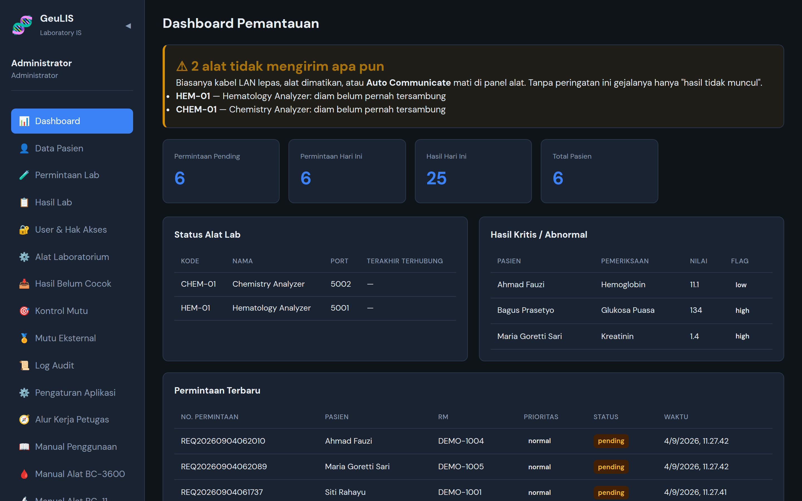
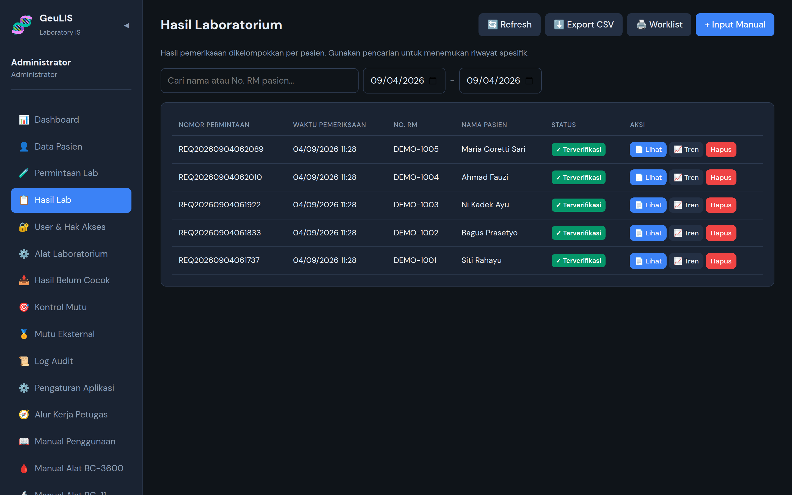
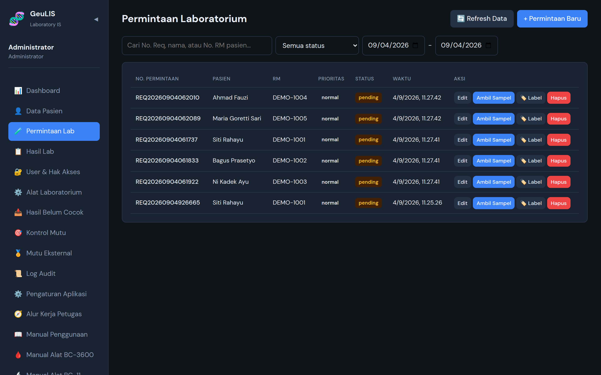
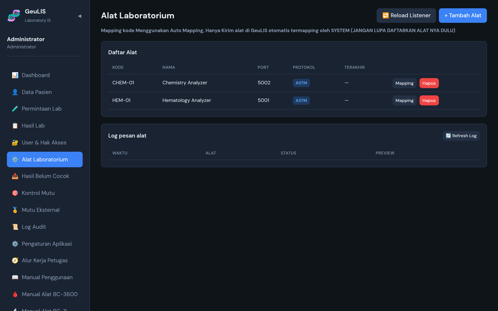

# GeuLIS

Sistem Informasi Laboratorium untuk rumah sakit — menerima hasil langsung dari
alat laboratorium, menandainya terhadap nilai rujukan, dan mengembalikannya ke
SIMRS.

Dipakai di rumah sakit yang sesungguhnya, dengan alat hematologi Mindray
(BC-3600, BC-11, BC-30s) dan bridging ke SIMRS Khanza.

[](LICENSE)

## Tampilan

Seluruh tangkapan layar di bawah memakai **data karangan** — bukan pasien
sungguhan.



Dashboard memperingatkan alat yang berhenti mengirim. Tanpa peringatan itu,
gejalanya hanya "hasil tidak muncul", dan baru ketahuan setelah ada yang
mengeluh.



| | |
|---|---|
|  |  |

## Menjalankan secara lokal

```bash
mysql -u root -p -e "CREATE DATABASE geulis"
mysql -u root -p geulis < database/geulis_fresh.sql

npm run setup            # pasang dependensi, salin .env.example, isi data awal
# lalu sunting backend/.env: DB_* dan JWT_SECRET (wajib, minimal 32 karakter)

npm run dev:backend      # :3001
npm run dev:frontend     # :5173, mem-proxy /api ke backend

cd backend && npm test   # 38 uji
```

Backend **berhenti** kalau `JWT_SECRET` kosong atau kurang dari 32 karakter —
itu disengaja, bukan galat pemasangan.

Database **tidak dibuat otomatis** — kalau belum ada, halaman login akan
menggantung tanpa pesan galat.

## Dokumentasi

| Dokumen | Isi |
|---|---|
| **[docs/LOGIKA_APLIKASI.md](docs/LOGIKA_APLIKASI.md)** | **Cara kerja aplikasi** — alur data, model data, keputusan di tiap titik. Mulai dari sini. |
| [docs/KOMUNIKASI_ALAT.md](docs/KOMUNIKASI_ALAT.md) | Gambaran umum komunikasi alat lab |
| [docs/BC-3600.md](docs/BC-3600.md) · [docs/BC-11.md](docs/BC-11.md) | Setelan dan diagnostik per alat |
| [docs/BRIDGING_SIMRS.md](docs/BRIDGING_SIMRS.md) | Jembatan ke SIMRS Khanza |
| [docs/REGULASI.md](docs/REGULASI.md) | PMK 24/2022, 43/2013, 411/2010 dan celah yang tersisa |
| [PANDUAN_SERVER.txt](PANDUAN_SERVER.txt) | Pemasangan di server rumah sakit |

Manual alat dan berkas regulasi aslinya ada di [docs/](docs/).

## Susunan

- **Backend** Node.js + Express (ESM), MariaDB lewat mysql2, JWT
- **Frontend** React + Vite
- **Produksi** nginx menyajikan `frontend/dist` dan mem-proxy `/api`, PM2
  menjalankan backend

Listener alat berjalan **di dalam proses backend yang sama**, bukan proses
terpisah.

## Lisensi

GeuLIS berlisensi **[GNU AGPL-3.0](LICENSE)**.

Artinya, singkatnya:

- **Rumah sakit bebas memakai, memasang, dan mengubahnya** untuk keperluan
  sendiri, tanpa biaya dan tanpa kewajiban apa pun.
- **Siapa pun yang mengubah GeuLIS lalu menyebarkannya atau menyajikannya lewat
  jaringan wajib menyertakan kode sumber perubahannya** kepada penerimanya.
  Tidak boleh ada versi tertutup.
- Memungut biaya untuk pemasangan, pelatihan, dan dukungan **diperbolehkan**.

Baca juga:

- **[DISCLAIMER.md](DISCLAIMER.md)** — penafian kesehatan. **Perangkat lunak ini
  bukan alat kesehatan.** Setiap hasil wajib diverifikasi tenaga yang berwenang,
  dan nilai rujukan bawaannya adalah contoh yang belum divalidasi.
- **[NOTICE](NOTICE)** — merek. Lisensi memberi hak atas kode, bukan atas nama
  "GeuLIS"; beri nama sendiri untuk versi ubahan Anda.
- **[CONTRIBUTING.md](CONTRIBUTING.md)** — cara menyumbang, termasuk perjanjian
  lisensi kontributor.

Repositori ini **tidak memuat manual pabrikan alat laboratorium** — dokumen itu
berhak cipta pemiliknya. Pengetahuan protokol di `docs/` ditulis ulang dari
rekaman lalu lintas jaringan alat yang sebenarnya.
